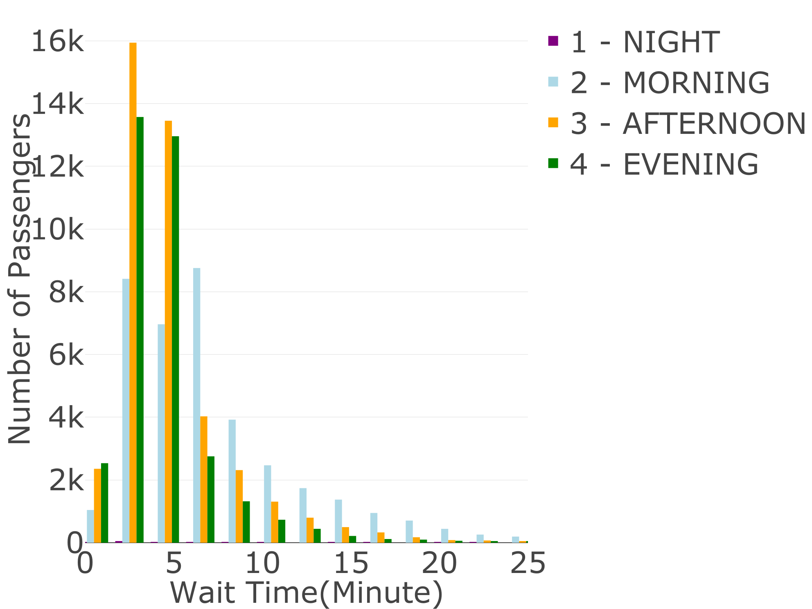
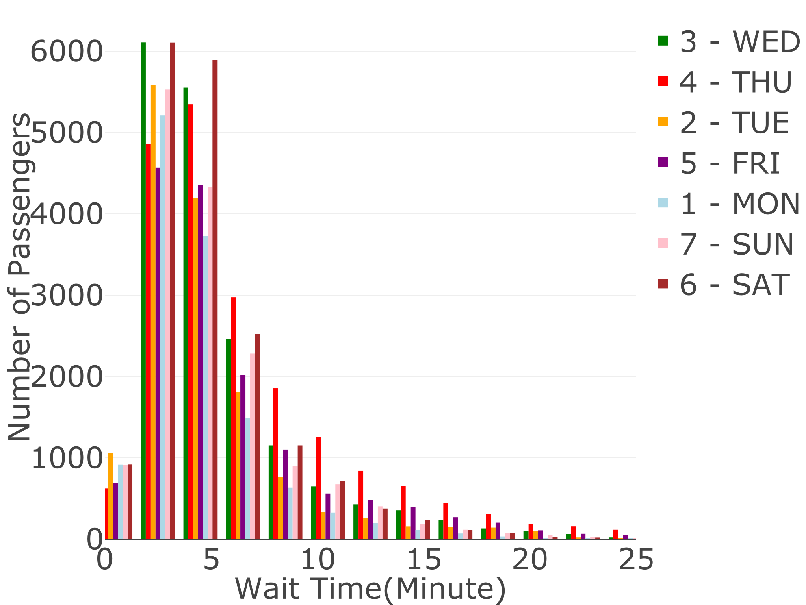
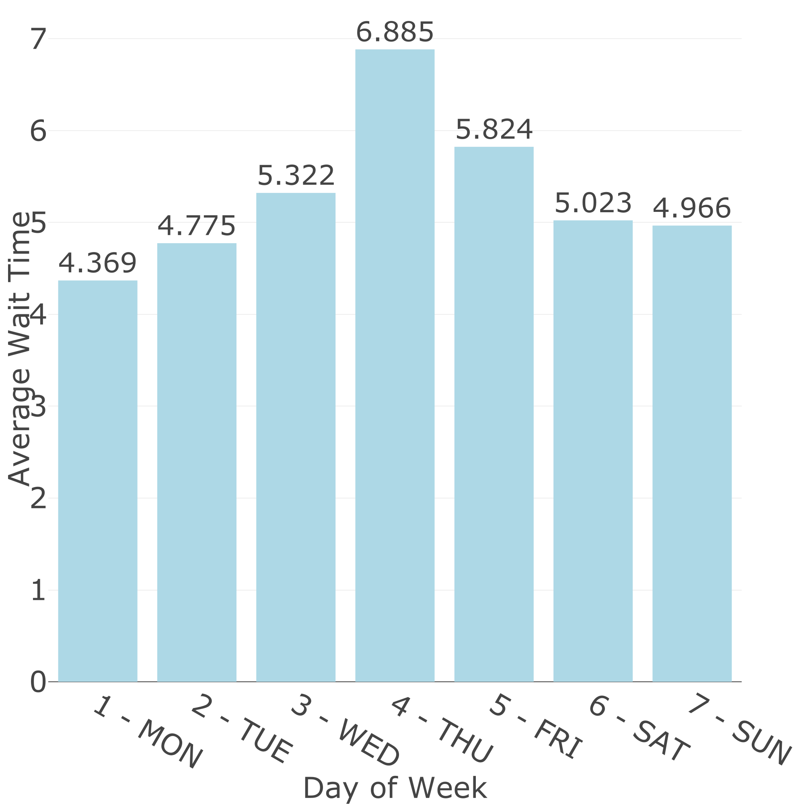
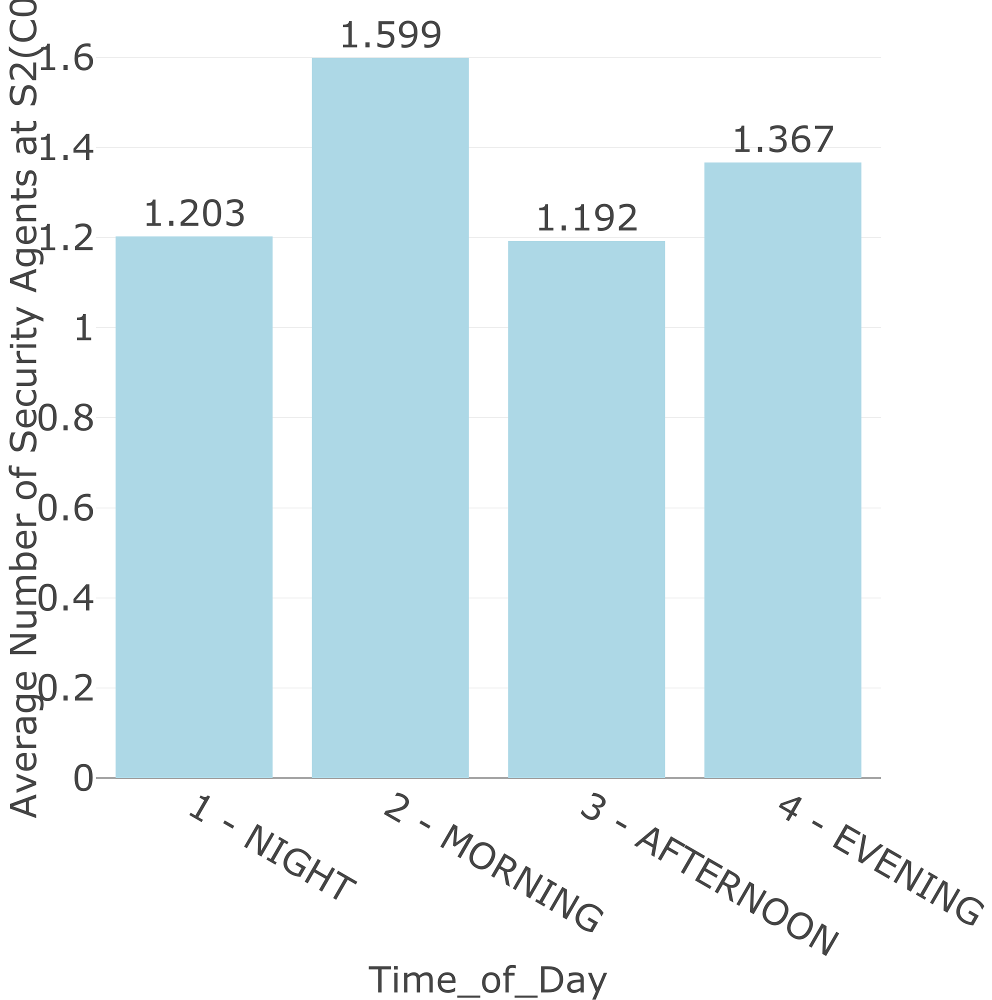

```{r, include=FALSE}
knitr::opts_chunk$set(echo = FALSE, warning = FALSE)
library(plotly)
library(tidyverse)
library(kableExtra)
library(htmlwidgets)
library(webshot)

axisfont<-list(size=36)
mars<-list(l=0, r=0, b=0, t=20)
```

### Introduction

It is common that a passenger gets screened at an airfield for security and management purpose. This screening process involves some major steps such as scanning the boarding pass at entrance, serving the passenger, and exiting the service desk. This process can be described by queuing theory, in which a statistical model is built to analyze the waiting time and service processes. It allows to examine the relationship between inter-arrivals, service times and the capacity of the system demonstrated by calculating the number of servers needed to achieve certain quality of service level. In the end, one can gain an overall picture of the efficiency and dynamics of the screening process.

We were given four data sets containing the details of the screening process at the four major airfields of the nation. Our goal was to explain the data sets through data definitions and explanations, to explore the data sets by visualizing and analyzing their variables and possible relationships, and finally to perform the queuing analysis to predict the expected wait time at each airfield.

### Data Definition

```{r}
BASA<-read.csv("BASA_AUC_2028_912.csv", header = TRUE)
Flight<-read.csv("dat_F_sub.csv")
Passenger<-read.csv("dat_P_sub_c.csv")
Y2026<-read.csv("years20262030.csv")
```

The four data sets had common variables. The BASA data set was the biggest one containing most of the common variables, hence we used it as the main data set. We compared the variables between BASA and Passenger data and noticed that Passenger had unique variables with suffix "Flag", which we thought was not useful for our analysis. Other unique variables in Passenger were presented in other tables as well, hence these variables were omitted in our Queuing Analysis section.

```{r}
setdiff(colnames(Passenger), colnames(BASA))
```

Similarly, the Flight data had variables that weren't really relevant or useful for our analysis, hence we also omitted them in Queuing Analysis.

```{r}
setdiff(colnames(Flight), colnames(BASA))
```

BASA and Y2026 had the same variables, except that Y2026 has airfields other than Auckland.

We gave a proper data definition in the following Table 1 for BASA data and for the unique variables in Passenger and Flight data in Table 2 and Table 3.

```{r}
DataDict<-BASA%>%select(-X)
DataDict<-data.frame(
  Variables=colnames(DataDict),
  Example=sapply(DataDict, function(x) paste(as.character(head(unique(x),1)), collapse = ", ")),
  Number.Unique=sapply(DataDict, function(x) length(unique(x))),
  PctMissing=sapply(DataDict, function(x) paste0(round(sum(is.na(x))/length(x), 4)*100,"%" ) ),
  Comment=c("Airfield from which the passenger departed: Auckland [AUC], Chebucto [CWL], Queenston [QUE], SaintFrancois [SAF]",
            "the date and time at which passengers exited the main queue S2, recorded to the nearest minute",
            "The waiting time of passenger in queue from S1 to S2, rounded up to the minute",
            "The number of security agents at S1 when passenger was scaned",
            "The number of security agents at S2 when passenger was scaned",
            "The average number of security agents at S1 and S2",
            "scheduled departure time",
            "actual departure time" ,
            "city of destination",
            "country of destination",
            "order",
            "ID for each passenger exited the main queue",
            "Departure_Date",
            "Departure_Time (recored in seconds: h*3600+m*60+s)",
            "departure time of day",
            "departure day is weekend or weeakday",
            "departure day in a week",
            "month of departure",
            "season of departure",
            "year of departure"
  ), row.names = NULL
)

DataDict%>%kable(booktabs = TRUE,caption = "BASA Variable Definition")%>%
  kable_styling(font_size=7, latex_options=c("striped","hold_position"))%>%
  column_spec(2, width = "8em")%>%
  column_spec(5, width = "15em")%>%
  row_spec(0,bold=TRUE)
```

```{r}
DataDict<-Passenger%>%select(setdiff(colnames(Passenger), colnames(BASA)))
DataDict<-data.frame(
  Variables=colnames(DataDict),
  Example=sapply(DataDict, function(x) paste(as.character(head(unique(x),2)), collapse = ", ")),
  Number.Unique=sapply(DataDict, function(x) length(unique(x))),
  PctMissing=sapply(DataDict, function(x) paste0(round(sum(is.na(x))/length(x), 4)*100,"%" ) ), 
  Comment=c("Valid passenger ID",
            "If Wait_Time is NA or not",
            "If S2 Schedule departure is NA or not",
            "If S2 Actural departure is NA or not",
            "If Schedule departure is NA or not",
            "Flight ID",
            "Delay in seconds"
  ),
  row.names = NULL
)

DataDict%>%kable(booktabs = TRUE,caption = "Passenger Variable Definition")%>%
  kable_styling(font_size=10, latex_options=c("striped","scale_down","hold_position"))%>%
  column_spec(2, width = "8em")%>%
  row_spec(0,bold=TRUE)
```

```{r}
DataDict<-Flight%>%select(setdiff(colnames(Flight), colnames(BASA)))
DataDict<-data.frame(
  Variables=colnames(DataDict),
  Example=sapply(DataDict, function(x) paste(as.character(head(unique(x),2)), collapse = ", ")),
  Number.Unique=sapply(DataDict, function(x) length(unique(x))),
  PctMissing=sapply(DataDict, function(x) paste0(round(sum(is.na(x))/length(x), 4)*100,"%" ) ),
  Comment=c("Flight ID",
            "total number of passengers",
            "actual number of passengers",
            "mimimum waiting time",
            "mean waiting time",
            "median waiting time",
            "maximum waiting time",
            "mean length of waiting time",
            "mean_City_Flag",
            "mode_BFO_Dest_City",
            "sum of the mode in the city",
            "number of destinated city",
            "mode_BFO_Dest_Country_Code",
            "sum of the mode in the country",
            "number of destinated country",
            "delay second"
  ), row.names = NULL
)

DataDict%>%kable(booktabs = TRUE,caption = "Flight Variable Definition")%>%
  kable_styling(font_size=10, latex_options=c("striped","scale_down","hold_position"))%>%
  column_spec(2, width = "8em")%>%
  row_spec(0,bold=TRUE)
```

We must also pointed out that there were flaws in these data sets that we had to correct. The BASA data contained the useful information from the Passenger data, as we have explained earlier. However there was a discrepancy of 10 minutes between the BASA Schedule Departure time and the Passenger Schedule Departure time. We believed that this difference is a minor mistake. BASA data contained the least amount of mistakes overall, hence another reason for us to use the BASA data directly in our queuing analysis. In addition, The Period_of_Week variable did not match with the Day_of_Week, therefore we have cleaned all these flaws before doing the subsequent analyses.

```{r}
#clean BASA data:
BASA<-BASA%>%mutate(Period_of_Week=case_when(
  Day_of_Week=="6 - SAT" | Day_of_Week=="7 - SUN" ~ "2 - WEEKEND",
  .default = "1 - WEEKDAY"
), S2=as.POSIXct(S2))
```

### Data exploration

In the data Y2026, there were only two kinds of seasons: winter and autumn. Autumn contained only 7 data points and winter had 3219 points, which in total accounted for the bulk of the data. One can see from the Airfield column of Table 4 that although it contained the most types of airfields among the four data sets, except for SaintFrancois(SAF), the other three airfields had negligible proportions. The airfields in the data set BASA were all Auckland (AUC), whereas in Y2026 there were only four data points for which the airfield was AUC. Compared with BASA, Y2026 provided too little information. If we analyze the data of Y2026 based on the combination of categories of Time_of\_ Day, Day_of_Week and Season respectively, the count of arrivals of Y2026 in most of clusters was almost zero, that is to say, the data of Y2026 was not very useful to the overall analysis, so we discard this data set.

```{r}
Y2026%>%group_by(across(c(Airfield, Season, Time_of_Day, Day_of_Week), as.factor))%>%tally()%>%spread(key=Day_of_Week, value=n)%>%
  mutate(across(everything(),~ifelse(is.na(.), 0, .)))%>%
  kable(booktabs = TRUE,caption = "Count of Arrivals in Each Cluster")%>%
  kable_styling(font_size=10, latex_options=c("striped","scale_down","hold_position"))%>%
  row_spec(0,bold=TRUE)
```

From the data definition Table 1 one can see the Wait_Time variable had nearly 15% missing data, thus deleting it will affect the result drastically. We chose to fill in the missing data with the mean value of the wait time. First, we divided the data based on the categories of Season(3 - SUMMER,4 - AUTUMN), Period_of_Week(1 - WEEKDAY,2 - WEEKEND), and Time_of_Day(1 - NIGHT,2 - MORNING,3 - AFTERNOON,4 - EVENING) into 16 clusters. Then we computed the mean value of the wait time in each cluster and used these means to fill the missing wait time of the corresponding cluster.

Airport queuing analysis can effectively improve passenger satisfaction and alleviate airport congestion. Imagine being a traveler at the airport and going through the boarding pass process. The process from entering the queue through S1 (recording the time of entering the queue) and leaving from S2 (recording the time of leaving the queue) to c number of open servers can be understood as a $M/M/c$ queue system. If we classify the data according to certain conditions, then for each cluster, we can convert the MMC problem into MM1 for analysis. The generalized server of each cluster has a special arrival rate and service rate.

Through observation, time periods are related to airport passenger flow. There are significant differences in airport traffic between season, weekend or not, and time of day conditions. For example, as we have seen in Data Exploration section that there are very few passengers from midnight to early morning due to unscheduled flights. As we explained in Data Exporation section, by observing the numbers of arrivals in different clusters of periods, we decided to group the BASA data into 16 clusters according to Season, Period_of_week and Time_of_day. This can prevent the cluster from having too many missing values in the early morning period that causes failure to calculate the arrival rate $\lambda$ and service rate $\mu$. Note that each cluster has different $\lambda$ and $\mu$ between groups. We calculated the rates according to $\lambda=\frac{count}{period\ of\ time}$ and $\mu=\frac{\bar{W_{q}}\lambda+\sqrt{(\bar{W_{q}\lambda})^2+4\bar{W_{q}\lambda}}}{2\bar{W_{q}}}$ where $\bar{W_{q}}$ is the average wait time.

```{r}
#make list of 16 clusters:
BASA_fill <- split(BASA, list(BASA$Season, BASA$Period_of_Week, BASA$Time_of_Day))

# fill missing wait time with mean
fill_missing <- function(df){
  mean_value <- round(mean(df$Wait_Time, na.rm = TRUE),0)
  df$Wait_Time[is.na(df$Wait_Time)] <- mean_value
  return(df)
}

BASA_fill<-map(BASA_fill, fill_missing)
```
However we found that there were still data points whose wait time were missing after the operation of filling the missing data. The reason was that the cluster had no data points, so there was no wait time data for calculating the mean value. In addition, we found that there was also a missing data in column C0. Since there were only two points of data with missing values, we decided to omit these two rows directly.

According to the Figure 1, we found that the number of passengers arrived in the morning, afternoon and evening were relatively equal. However, there was a distinct disparity in the evening, where the number of passengers showed a noticeable decline compared to the other three periods. This was expected because normally there is few flights between 0-6 o'clock or most of the people would not choose to fly in this time period. In addition, we found from Figure 1 that the wait time in a queue to go through the security check S2 for AFTERNOON and EVENING was mainly concentrated in 2-5 minutes, which was relatively shorter. Notably, when the wait time exceeded 5 minutes, the number of passengers in the queue for MORNING was significantly higher than that for other periods, and in the morning, the passengers waiting in line for 6-7 minutes were the most numerous, totaling 8757. So we concluded that: The passengers in the morning experienced the longest wait times in line, and the queuing period of afternoon and evening were about the same, basically within 5 minutes.

\begin{minipage}[t]{0.5\textwidth}
```{r, echo=FALSE}
BASA_fill<-map(BASA_fill, function(df){df%>%filter(!is.na(Wait_Time) & !is.na(C0))})
BASA<-do.call(rbind, BASA_fill)
```

```{r, echo=FALSE}
#Classification according to Time_of_Day(Morning;Afternoon;Evening;Night)
time_of_day_categories <- unique(BASA$Time_of_Day)

p0 <- plot_ly()
for (time_of_day in time_of_day_categories) {
  subset_data <- BASA[BASA$Time_of_Day == time_of_day, ]
  color <- switch(
    time_of_day,
    "2 - MORNING" = "lightblue",
    "3 - AFTERNOON" = "orange",
    "4 - EVENING" = "green",
    "1 - NIGHT" = "purple"
  )
  p0 <- add_trace(
    p0,
    type = "histogram",
    x = subset_data$Wait_Time,
    name = time_of_day,
    marker = list(color = color, line = list(color = "black")),
    xbins = list(size = 2)
  )
}

p0 <- layout(
  p0,
  margin=mars,
  xaxis = list(title = list(text="Wait Time(Minute)", font=axisfont), tickfont=axisfont,range = c(0, 25)),
  yaxis = list(title = list(text="Number of Passengers", font=axisfont), tickfont=axisfont),
  legend=list(font=axisfont)
)

saveWidget(widget = p0, file = "./Figures/day_wt.html")
shots<-webshot(url = "./Figures/day_wt.html", file = "./Figures/day_wt.png", delay = 1, zoom = 2)
```

```{r, echo=FALSE, fig.align='center', fig.cap = "Wait Time with Different Time of Day", out.height="3in", out.width="3in"}

```
\end{minipage}
\begin{minipage}[t]{0.5\textwidth}
\vspace{13pt}
```{r, echo=FALSE}
# Average Wait_Time for each Time_of_Day
avg_time_day <- tapply(BASA$Wait_Time, BASA$Time_of_Day, mean)

avg_time_day_df <- data.frame(Time_of_Day = names(avg_time_day),
                              Average_Wait_Time = avg_time_day)

ad <- avg_time_day_df%>%plot_ly(
  x = ~Time_of_Day,
  y = ~Average_Wait_Time,
  type = "bar",height = 1000,
  marker = list(color = "lightblue", line = list(color = "black")),
  text = ~round(Average_Wait_Time,3),
  textposition = "outside",
  textfont=axisfont) %>%
  layout(
    margin=mars,
    xaxis = list(title = list(text="Time_of_Day", font=axisfont), tickfont=axisfont),
    yaxis = list(title = list(text="Average Wait Time", font=axisfont), tickfont=axisfont),
    legend=list(font = axisfont),
    font=axisfont
  )

saveWidget(widget = ad, file = "./Figures/a_day_wt.html")
shots<-webshot(url = "./Figures/a_day_wt.html", file = "./Figures/a_day_wt.png", delay = 1, zoom = 2)
```

```{r, echo=FALSE, fig.align='center', fig.cap = "Average Wait Time with Different Time of Day", out.height="2in", out.width="2in"}

```
\end{minipage}

In order to compare the wait times for each Time_of_Day more accurately, we calculated their respective averages shown in Figure 2. As previously observed: the wait time in the morning was the longest, with an average of about 7 minutes; afternoon and evening had about the same wait time, with an average of approximately 4 minutes. Lastly, although there was very little data for the night, the average wait time for the night was the second longest, at around 6 minutes. Again one can expect this due to the lack of staff in the airport at night.

\begin{minipage}[t]{0.5\textwidth}
Next, we compared and analyzed the wait time with different day of week, and the result was shown in Figure 3. On the whole, the longer the wait time was, the less the number of passengers was. In addition, we found that regardless of the day of the week, when the wait time was within the range of 2-5 minutes, the number of passengers was significantly more than others, in which the queue on Saturday was the largest, with a total of 11,994 passengers, followed by Wednesday(11,656). When the wait time was greater than or equal to 6 minutes, the number of people queuing up for S2 on Thursday was the largest; in contrast, Monday's passengers count was basically the smallest. Thus, we concluded that Thursday's wait time was the longest, while Monday's wait time was the shortest.
\end{minipage}
\begin{minipage}[t]{0.5\textwidth}
\vspace{13pt}
```{r, echo=FALSE}
#Classification by day of the week
day_of_week_categories <- unique(BASA$Day_of_Week)

p2 <- plot_ly()
for (day_of_week in day_of_week_categories) {
  subset_data <- BASA[BASA$Day_of_Week == day_of_week, ]
  
  color <- switch(
    day_of_week,
    "1 - MON" = "lightblue",
    "2 - TUE" = "orange",
    "3 - WED" = "green",
    "4 - THU" = "red",
    "5 - FRI" = "purple",
    "6 - SAT" = "brown",
    "7 - SUN" = "pink"
  )
  
  p2 <- add_trace(
    p2,
    type = "histogram",
    x = subset_data$Wait_Time,
    name = day_of_week,
    marker = list(color = color, line = list(color = "black")),
    xbins = list(size = 2)
  )
}

p2 <- layout(
  p2,
  margin=mars,
  xaxis = list(title = list(text="Wait Time(Minute)", font=axisfont), tickfont=axisfont, range = c(0, 25)),
  yaxis = list(title = list(text="Number of Passengers", font=axisfont), tickfont=axisfont),
  legend=list(font = axisfont)
)

saveWidget(widget = p2, file = "./Figures/week_wt.html")
shots<-webshot(url = "./Figures/week_wt.html", file = "./Figures/week_wt.png", delay = 1, zoom = 2)
```

```{r, echo=FALSE, fig.align='center', fig.cap = "Wait Time with Different Day of Week", out.height="3in", out.width="3in"}

```
\end{minipage}

:::::: {.cols data-latex=""}

::: {.col data-latex="{0.48\textwidth}"}
Figure 4 presented the average wait time for each day of the week. As we had mentioned earlier, Thursday's average wait time was the longest, at nearly 7 minutes; Monday's wait time was the shortest with an average of 4.37 minutes. Tuesday, Saturday and Sunday had about equal wait times, around 5 minutes. On the other hand, Wednesday and Friday reported average wait times within the 5-6 minute range.
:::

::: {.col data-latex="{0.02\textwidth}"}
\ 
<!-- an empty Div (with a white space), serving as
a column separator -->
:::

::: {.col data-latex="{0.5\textwidth}"}
```{r, echo=FALSE}
#Average Wait_Time per Day_of_Week
avg_time <- tapply(BASA$Wait_Time, BASA$Day_of_Week, mean)

avg_time_df <- data.frame(Day_of_Week = names(avg_time),
                          Average_Wait_Time = avg_time)

aw <- avg_time_df%>%plot_ly(x = ~Day_of_Week,
              y = ~Average_Wait_Time,
              type = "bar",height = 1000,
              marker = list(color = "lightblue", line = list(color = "black")),
              text = ~round(Average_Wait_Time,3),
              textposition = "outside",
              textfont = axisfont) %>%
  layout(margin=mars,
         xaxis = list(title = list(text="Day of Week", font=axisfont), tickfont=axisfont),
         yaxis = list(title = list(text="Average Wait Time", font=axisfont), tickfont=axisfont),
        legend=list(font = axisfont), font=axisfont
)

saveWidget(widget = aw, file = "./Figures/a_week_wt.html")
shots<-webshot(url = "./Figures/a_week_wt.html", file = "./Figures/a_week_wt.png", delay = 1, zoom = 2)
```

```{r, echo=FALSE, fig.align='center', fig.cap = "Average Wait Time with Different Day of Week", out.height="2in", out.width="2in"}

```
:::
::::::


\begin{minipage}[t]{0.5\textwidth}
```{r, echo=FALSE}
#Classification according to Season
season_categories <- unique(BASA$Season)

p3 <- plot_ly()
for (season in season_categories) {
  subset_data <- BASA[BASA$Season == season, ]
  
  color <- switch(
    season,
    "1 - WINTER" = "green",
    "2 - SPRING" = "red",
    "3 - SUMMER" = "lightblue",
    "4 - AUTUMN" = "orange",
  )
  
  p3 <- add_trace(
    p3,
    type = "histogram",
    x = subset_data$Wait_Time,
    name = season,
    marker = list(color = color, line = list(color = "black")),
    xbins = list(size = 2)
  )
}

p3 <- layout(
  p3,
  margin=mars,
  xaxis = list(title = list(text="Wait Time(Minute)", font=axisfont), tickfont=axisfont, range = c(0, 23)),  # Closing parenthesis added here
  yaxis = list(title = list(text="Number of Passengers", font=axisfont), tickfont=axisfont),
  legend=list(font = axisfont)
)

saveWidget(widget = p3, file = "./Figures/season_wt.html")
shots<-webshot(url = "./Figures/season_wt.html", file = "./Figures/season_wt.png", delay = 1, zoom = 2)
```

```{r, echo=FALSE, fig.align='center', fig.cap = "Wait Time with Different Season", out.height="3in", out.width="3in"}

```
\end{minipage}
\begin{minipage}[t]{0.5\textwidth}
\vspace{13pt}
Then, we examined the disparities in wait time and passenger volumes based on seasons in Figure 5. Since the data for Spring and Winter were too scarce, we ignored them and only compared Summer and Autumn's wait time. When the range of wait time shifted from 0-1 minute to 1-2 minutes, there was a significant increase in the number of people in the queue. Specifically, the number of people waiting in line for S2 during Summer increased from 1,714 to over 10,162, while in Autumn, it surged from 4,232 to 27,792---marking the highest count in both seasons across various wait time ranges. As the wait time exceeded 2 minutes, the number of passengers in line decreased for both Summer and Autumn. 
\end{minipage}
However, regardless of the wait time range, the queue attendance for S2 during Autumn consistently exceeded that of Summer.

:::::: {.cols data-latex=""}

::: {.col data-latex="{0.48\textwidth}"}
Figure 6 revealed that the average duration of security line waits remained consistently above five minutes across both seasons, with a negligible difference of approximately thirty seconds. This meant that while seasonal changes substantially influenced airport passenger traffic, their impact on security queue wait time was relatively minor.
:::

::: {.col data-latex="{0.02\textwidth}"}
\ 
<!-- an empty Div (with a white space), serving as
a column separator -->
:::

::: {.col data-latex="{0.5\textwidth}"}
```{r, echo=FALSE}
#Average Wait_Time for each Season
avg_time_season <- tapply(BASA$Wait_Time, BASA$Season, mean)

avg_time_season_df <- data.frame(Season = names(avg_time_season),
                                 Average_Wait_Time = avg_time_season)

as <- avg_time_season_df%>%plot_ly(
  x = ~Season,
  y = ~Average_Wait_Time,
  type = "bar",height = 1000,
  name = "Average Wait Time",
  marker = list(color = "lightblue", line = list(color = "black")),
  text = ~round(Average_Wait_Time,3),
  textposition = "outside",
  textfont = axisfont) %>%
  layout(margin=mars,
         xaxis = list(title = list(text="Season",font=axisfont), tickfont=axisfont),
         yaxis = list(title = list(text="Average Wait Time",font = axisfont), tickfont=axisfont),
         legend=list(font = axisfont), font=axisfont
  )

saveWidget(widget = as, file = "./Figures/a_season_wt.html")
shots<-webshot(url = "./Figures/a_season_wt.html", file = "./Figures/a_season_wt.png", delay = 1, zoom = 2)
```

```{r, echo=FALSE, fig.align='center', fig.cap = "Average Wait Time with Different Season", out.height="1.3in", out.width="1.3in"}

```
:::
::::::

Subsequent analysis focused on comparing the quantity of servers at checkpoint S2 (C0) during different times of day. Due to data limitations, NIGHT time data could barely be seen in Figure 7. With C0 between 0-1, AFTERNOON had the highest passenger count (33,704) and MORNING had the lowest (15,881). Conversely, when C0 increased to 2-3, MORNING had the highest queue volume (21,762), and AFTERNOON had the least (7,792). When the queue size at the airport in the morning increased by 5000, the number of servers for C0 increased from 0-1 to 2-3. This trend suggested that the airport strategically raised the number of servers in the MORNING by 1-2 to reduce passengers' wait time.

```{r, echo=FALSE}
#Number of C0 (servers of S2) with different Time_of_Day
p4 <- plot_ly()
for (time_of_day in time_of_day_categories) {
  subset_data <- BASA[BASA$Time_of_Day == time_of_day, ]
  color <- switch(
    time_of_day,
    "2 - MORNING" = "lightblue",
    "3 - AFTERNOON" = "orange",
    "4 - EVENING" = "green",
    "1 - NIGHT" = "purple"
  )
  p4 <- add_trace(
    p4,
    type = "histogram",
    x = subset_data$C0,
    name = time_of_day,
    marker = list(color = color, line = list(color = "black")),
    xbins = list(size = 2)
  )
}

p4 <- layout(
  p4,
  margin=mars,
  xaxis = list(title = list(text="The Number of Security Agents",font=axisfont), tickfont=axisfont),
  yaxis = list(title = list(text="Number of Passengers",font=axisfont), tickfont=axisfont),
  legend=list(font = axisfont)
)

saveWidget(widget = p4, file = "./Figures/day_C0.html")
shots<-webshot(url = "./Figures/day_C0.html", file = "./Figures/day_C0.png", delay = 1, zoom = 2)
```

```{r, echo=FALSE, fig.align='center', fig.cap = "Number of Servers of S2 (C0) with Different Time of Day", out.height="3in", out.width="3in"}

```

From Figure 8 we found that the average number of security agents at S2 in the morning was the highest, approximately 1.60. The evening period followed closely with an average of 1.37. And the night's average number of servers was comparable to the average for the afternoon, around 1.20 servers. Overall, we found that the number of servers was rather uniformly distributed around 1.3, which supported our M/M/1 model assumption in the subsequent Queuing Analysis.

```{r, echo=FALSE}
# Average C0(The Number of Security Agents at S2) for each Time_of_Day
avg_time_day <- tapply(BASA$C0, BASA$Time_of_Day, mean)

avg_time_day_df <- data.frame(Time_of_Day = names(avg_time_day),
                              Average_C0 = avg_time_day)

a_C0 <- avg_time_day_df%>%plot_ly(
  x = ~Time_of_Day,
  y = ~Average_C0,
  type = "bar",height = 1000,
  marker = list(color = "lightblue", line = list(color = "black")),
  text = ~round(Average_C0,3),
  textposition = "outside",
  textfont = axisfont) %>%
  layout(
    margin=mars,
    xaxis = list(title = list(text="Time_of_Day",font=axisfont), tickfont=axisfont),
    yaxis = list(title = list(text="Average Number of Security Agents at S2(C0)",font=axisfont), tickfont=axisfont),
    legend=list(font = axisfont), font=axisfont
  )

saveWidget(widget = a_C0, file = "./Figures/a_day_C0.html")
shots<-webshot(url = "./Figures/a_day_C0.html", file = "./Figures/a_day_C0.png", delay = 1, zoom = 2)
```

```{r, echo=FALSE, fig.align='center', fig.cap = "Average Number of Servers of S2 (C0) with Different Time of Day", out.height="2in", out.width="2in"}

```

### Queuing Analysis

```{r}
MakeTbl<-function(cluster){
  if(is_empty(unique(cluster$Period_of_Week))==TRUE){
    Result <- data.frame(Season=NaN, Period_of_Week=NaN,Time_of_Day=NaN,Count=NaN,Minute=NaN,Arrival_Rate=NaN,Avg_Wait_Time=NaN,Service_Rate=NaN,Avg_Servers=NaN)
  }else{
    if(unique(cluster$Period_of_Week)=="1 - WEEKDAY"){Minute<-13*5*6*60}else{Minute<-13*2*6*60}
    
    Count<-nrow(cluster) #number of arrivals
    lambda <-Count/Minute #lambda is the arrival rate (number of arrivals per unit time)
    Wq <- mean(cluster$Wait_Time) #Wq is the average wait time
    mu <- (Wq*lambda+sqrt((Wq*lambda)^2+4*Wq*lambda))/(2*Wq) #mu is the service rate per unit time
    c <- mean(cluster$C0,na.rm = TRUE)
    
    Result <- data.frame(Season=unique(cluster$Season),Period_of_Week=unique(cluster$Period_of_Week),
                         Time_of_Day=unique(cluster$Time_of_Day),Count,Minute=Minute,Arrival_Rate=lambda,
                         Avg_Wait_Time=Wq,Service_Rate=mu,Avg_Servers=c)
  }
  return(Result)
}
Result<-do.call(rbind, map(BASA_fill, MakeTbl))
```

```{r}
Result%>%select(-c(Season, Period_of_Week,Time_of_Day))%>%
  kable(booktabs = TRUE,caption = "Estimates of Parameters")%>%
  kable_styling(font_size=7, latex_options=c("striped","scale_down", "hold_position"))%>%
  row_spec(0,bold=TRUE)
```

Table 5 showed the arrival rate, service rate, average waiting time and average server of each group. Since there were no passengers on summer weekend nights and the average waiting time on autumn weekend nights was missing, the relevant parameters of these two clusters cannot be known. It is clearly observed that longer waiting time is expected during the day compared to the night. It can be seen from the arrival rate that the airport had more passengers during the day than the night. Service rates also reflect the airport's increase in open servers to cope with high traffic. This is reasonably consistent with reality.

Recall that we were considering a multi-servers queue system $M/M/c$ with a generalized number of servers c [@PPT].

```{r}
regression_data <-Result%>%transmute(Avg_Servers, Arrival_Rate,Service_Rate,
                                     arrival_rate_perserver=Arrival_Rate/Avg_Servers,
                                     service_rate_perserver=Service_Rate/Avg_Servers)

# Regression model
regression_model<- lm(service_rate_perserver ~ arrival_rate_perserver,data = regression_data[-c(1,9,13),])
```

```{r}
regression_data%>%
  kable(booktabs = TRUE,caption = "Regression Data")%>%
  kable_styling(font_size=7, latex_options=c("striped","scale_down", "hold_position"))%>%
  row_spec(0,bold=TRUE)
```

From Table 6, we noticed that there may be a positive correlation between the service rate per server and the arrival rate per server. We assumed a linear relationship between them, say $\frac{\mu}{c}=a+b\cdot \frac{\lambda}{c}$, that is, $\mu=\mu(\lambda,c)=ac+b\lambda$, where $\lambda$ was the arrival rate, $c$ was the average number of servers, and $\mu$ was the service rate. We performed a linear regression on these two variables and got $\hat{a}=$ `r regression_model$coefficients[1]` and $\hat{b}=$ `r regression_model$coefficients[2]`. The Figure 9 below reflected this linear positive relationship and the clusters' observations $(\frac{\lambda}{c},\frac{\hat{\mu}}{c})$ closely lied on the regression line. .

```{r, fig.cap="Regression Line and Points"}
plot(regression_data[-c(3,4),]$arrival_rate_perserver, regression_data[-c(3,4),]$service_rate_perserver, pch = 16, col = "blue", xlab = "Arrival rate per server", ylab = "Service rate per server")

abline(regression_model, col = "red")

legend("topleft", legend = c("Points", "Regression Line"), col = c("blue", "red"), pch = c(16, NA), lty = c(NA, 1))
```

The reason of getting a small variance around the line was that the number of open servers increases as $\lambda$ increases by airport's proactive adjustments. This means when more arrivals occur, in order to control the number in queue, the airport adds new open servers reasonably to maintain balance.

Consider $M/M/1$ system, the probability of new arrival's wait time in queue is $x$ given that there are $n$ passengers before this new arrival in the system is $Gamma(n,\mu)$. Because we can make assumption that all services time are independent for each passenger and each one is exponential distribution with parameter $\mu$, a sum of $n$ independent exponential random variables is a Gamma distribution with parameters $n$ and $\mu$. Then we have $\mathbb{P}(x)=\sum_{n=1}^{\infty}\int_{0}^{x}\frac{\mu^{n}t^{n-1}e^{-\mu t}}{(n-1)!}dt(1-\rho)\rho^{n}=1-\rho e^{-u(1-\rho)x}$ where $\rho=\frac{\lambda}{\mu}$.

We can conclude that QoS level is $\mathbb{P}(x)=1-\rho e^{-\mu(1-\rho)x}$. We are considering $M/M/c$ as $M/M/1$ with a generalized server, thus we have $\mu=\hat{a}c+\hat{b}\lambda$ by regression result.

$\lambda<\mu$ is a stable condition for queuing system. If the arrival rate $\lambda$ is greater than the service rate $\mu$, then the number in queue is unbounded. That means the queue would grow infinitely. This cannot happen in reality because the airport would increase service rates by providing more staff to cope with the sudden increase in arrivals, however one can still experience a very long period in a queue under some extreme situations.

In our data, we had $\lambda<\hat{\mu}$ and the QoS level $\mathbb{P}(x)=1-\frac{\lambda}{\hat{a}c+\hat{b}\lambda}e^{-(\hat{a}c+\hat{b}\lambda-\lambda)x}=1-\frac{\lambda}{0.064+1.096\lambda}e^{-(0.064+1.096\lambda-\lambda)x}$ shown in Table 7.

```{r}
# prediction of prob of waittime <x for given cluster related information and time x
predict_prob_waittime <- function(season, PeriodOfWeek, PeriodOfDay,x){
  match_set <- Result %>% filter(Season == season,Period_of_Week == PeriodOfWeek,Time_of_Day == PeriodOfDay)
  my_lambda <-match_set$Arrival_Rate
  my_mu <-match_set$Service_Rate
  my_c <-match_set$Avg_Servers
  a_hat<-as.numeric(regression_model$coefficients[1])
  b_hat<-as.numeric(regression_model$coefficients[2])
  Pr<-1-my_lambda/(a_hat*my_c+b_hat*my_lambda)*exp(-(a_hat*my_c+b_hat*my_lambda-my_lambda)*x)
  return(round(Pr,5))
}

PlotCDF<-function(df, Time){
  df<-cbind(Time, df)
  df<-df%>%gather("Cluster", "Value",2:length(df))
  p<-ggplot(df, aes(x = Time, y = Value, color = Cluster)) +
    geom_line() +
    labs(x = "Time in mins", y = "CDF") +
    guides(fill=guide_legend(byrow = TRUE)) +
    theme(legend.spacing.y=unit(0.01, "cm"), legend.key.height = unit(0.01,"cm"))
  print(p)
}
```

```{r}
checkpoint <-seq(5,30,5)
Result<-Result%>%na.omit()
P<-Result%>%apply(1, function(x){
  res<-sapply(checkpoint, function(val){predict_prob_waittime(season=x[1],PeriodOfWeek=x[2],PeriodOfDay=x[3],x=val)})
  return(res)
})%>%t()
dimnames(P)<-list(rownames(Result), paste0("Pr(<", checkpoint, " mins)") )
P%>%kable(booktabs = TRUE,caption = "Performance Level")%>%
  kable_styling(font_size=7, latex_options=c("striped","scale_down","hold_position"))%>%
  row_spec(0,bold=TRUE)%>%
  column_spec(1,bold=TRUE)
```

In general, Table 7 is the probability distribution of waiting time spent in queue for each cluster respectively. For better visualization, we plotted the cumulative density function in Figure 10. It reflected the congestion level of queues at the airport at different times. The faster the density curve approaches to 1, the shorter the queue time that passengers can expect. For example, we can see from the figure that the airport was busier in the evenings on summer weekdays, and passengers were expected to spend more time waiting in queues. The airport management can also try to add new servers during this time period to alleviate the pressure on traffic. In addition, we noticed that the upper part of the graph contains several curves that quickly approach 0. The starting points $(0, \mathbb{P}(0))$ of these curves are close to 1, which indicated that during these times, there were very few or no people in the queue, and passengers can directly pass through the queue and enter the server. This situation mostly occurs at night, possibly due to the low number of passenger arrivals caused by the low number of scheduled flights at the airport during the period.

```{r,fig.height=3, fig.width=9, fig.cap = "Cumulative Distribution Function by Cluster Level"}
checkpoint <-0.0000001*exp(seq(0.1,19.5,0.1))

P<-apply(Result, 1, function(x){
  res<-sapply(checkpoint, function(val){predict_prob_waittime(season=x[1],PeriodOfWeek=x[2],PeriodOfDay=x[3],x=val)})
  return(res)
})
P<-as.data.frame(P)

PlotCDF(P, Time = checkpoint)
```

### References
